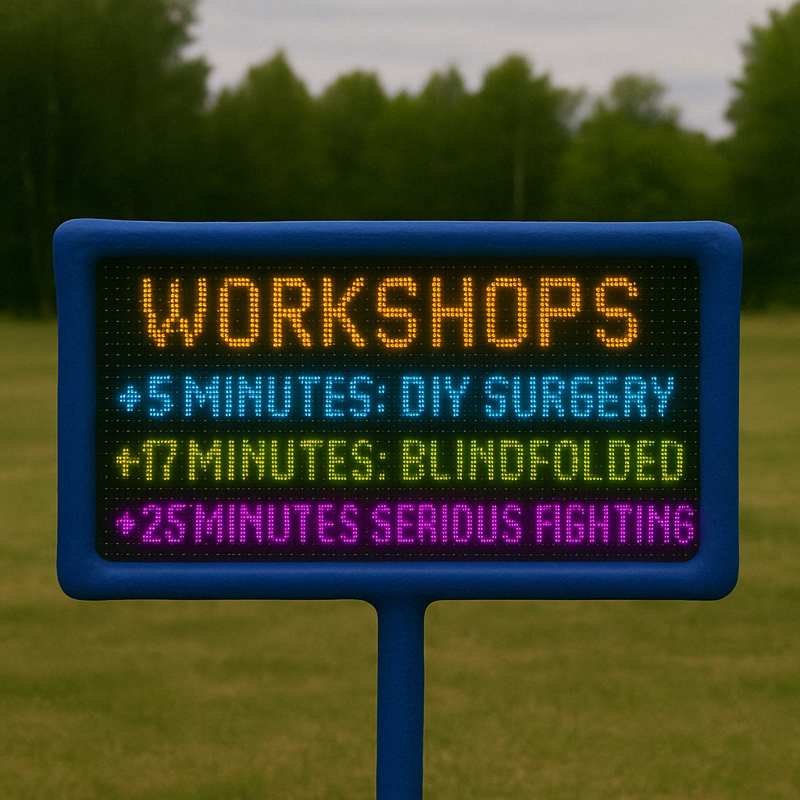

## **Outdoor LED Display for Workshop Schedule**

> Dream Applicaiton for Kiezburn 2025

### Images & Sketches

 

[A little demo of the software ( WIP ) 2542x1258](attachments/88101f34-d130-4cfa-a113-43e1a9f4ed12.mp4)

[If you are (un)lucky you might chance upon an advertising for the other services provided at the burn 2542x1258](attachments/646cfd31-8b18-4a2c-b916-d6e3770b4034.qt)

[Important message that will be displayed while the burn is happening, so there can be no misunderstandings 2542x1258](attachments/1314d3a6-feeb-44d4-a268-36e528dcbb43.qt)

---

### Description

> Have you ever missed out all the beautiful workshops & events you so wanted to go to?
>
> Is your phone dead and you have no idea what time it is?
>
> Too high to understand the fifty-page workshop plan? 
>
> **Then this Dream is for you!**

An outdoor LED display that shows the *current workshop schedule in real time*. Positioned in a high-traffic area, it helps Burners practice immediacy and make spontaneous decisions about where to go next.

Built using four P5 outdoor RGB LED panels driven by a Raspberry Pi, the display always shows what is happening right now & where. The data will be taken from the workshop plan. It runs throughout the day and night — at night, brightness is lowered to remain visible without being overwhelming.

Designed to be weatherproof and reusable.

**Size:** 64cm x 32cm\n**Resolution:** 160x80

### Design Goals

In order of importance, this is what I want to achieve with the Project

1. **Convey Information** in an easy to understand manner to foster Immediacy at the Burn
2. **Minimize sensory overload** from a flashing LED sign
3. **Be silly, artistic & fun**

#### Minimizing Sensory Overload

LED Signs can easily be ugly & overwhelming - destroying your night vision and unnecessarily drawing your attention. To mitigate this, these are some measures I am implementing / considering:

* Prefer warm / red color over others: Preserves night vision and is easier on the eyes
* Reduce unecessary movement and flashing images
* Use the minimum necessary brightness to be clearly readable - especially at night

#### Artistic Vision

Since we are at a Burn, it wouldn't be proper to not have some silliness involved. 

There will be funny messages & burn related content involved, in the form of messages displayed from time to time. 

Physically, I also would also like to have it look less "black-rectangle", but rather be artistic and playful. 

My primary focus will be on getting the other two design goals & technical aspects right however, before spending any left over time, attention and motivtion on the physical make-up. 

---

### 📍 Where at Kiezburn would you like your Dream/ Art to be?

Ideally **near the Info Point**, or in another **highly frequented area**.

---

### Is/Has This Dream…

| Attribute | Answer |
|----|----|
| **Music / Sound** | No |
| **Performances** | No |
| **Workshops / classes / discussions** | No |
| **For Kids** | If they can read |
| **Adults only** | No |
| **Recurring / pre-existing Dream?** | No |
| **Will your dream come with or without financial help?** | Im not sure what this means |

---

### Environmental Impact

* The dream will be reused at other burns (Planned for this year: Hamburn, Burning Bear, FTE)
* The panels are **durable outdoor-rated electronics**, and all wiring and framing components are designed to last.

---

### Cost Estimate

| **Item** | **Source** | **Estimated Price (EUR)** |
|----|----|----|
| 4× Outdoor P5 HUB75E LED Panels  | [eBay](https://www.ebay.de/itm/305982678542?itmmeta=01JRZ4KSM20DW0DZ2R3S1WHXNV&hash=item473dfd260e:g:dtoAAOSwJw5fAEAr#:\~:text=EUR%2044%2C00) / Kleinanzeigen / Online | 100.0 |
| RGB Matrix HAT | [BerryBase](https://www.berrybase.de/adafruit-rgb-matrix-hat-rtc-fuer-raspberry-pi-mini-kit)  | 27.45 |
| Mean Well UHP-200-5 Power Supply | [Reichelt](https://www.reichelt.de/de/de/shop/produkt/schaltnetzteil_geschlossen_200_w_5_v_40_a-256071) | 52.30 |
| 3D Printing Filament | [Bambu](https://eu.store.bambulab.com/de/products/asa-filament) | 25.00 |
| MicroSD Card (32 GB) | [Ebay](https://www.ebay.de/itm/266611124556?_skw=micro+sd+karte+32gb&itmmeta=01JS1AHQSESBH88C6HD69FAA6A&hash=item3e1342e94c%3Ag%3ARpkAAOSwqQFn3q6e&itmprp=enc%3AAQAKAAAA0FkggFvd1GGDu0w3yXCmi1dM%2BUXserQFnCPR7iXj%2FMnwtnjfY7Fi3XsqkLUNbJiwddoYm9Z7fD45j6laqBEuOuEUUnGkfwUj0vs%2F6bl%2F138b4QDrtneLV4eUFhWYhyWJV6x9DHGjJeGx7P44SPBsC7B4wNLIQYpq2PVadXXdb%2B%2Bn6w8U8%2Bul7RO4B5lxIhm1adhfwsyTjZ98EkURYdkKIfxaddY5Fi2aAG54znQ7rgvEaKBDXucQJInAJJVk0U72rAhVBgW5DKJTUM0PmuJc1yc%3D%7Ctkp%3ABlBMUIb9xqrIZQ&var=566367769169) | 7.20 |
| Aluminium Extrusion Profile 2m | [Ebay](https://www.ebay.de/itm/284455289033?_skw=20x60+alu+profil&itmmeta=01JS6V6TWGT1M1AHEXWA1044EY&hash=item423adb40c9:g:CsEAAOSwECZnTFZ3&itmprp=enc%3AAQAKAAAA0FkggFvd1GGDu0w3yXCmi1d2wH7FRF9dClp8XG6wy%2Bkw6lD5%2Bp4AxyOIo6%2FkTwZ3HUXYyNyVDFMz9LLMUENfWgaltft2USk28NFBkludZzjNo3U4BK4XWJuRB1ct%2F4s077cFw6cHWP%2FsjUjNSIINGEKeXi4sZFJLkPnPiSNn5M4ZION6AIuJIomosdqWsDDSKa4BO1aOaVceRV%2Fxxq6jcBAE4h4Q01%2BWfBaHqPjsKQuL3%2B0VvGzcfpXOynxxZR9W7j1uYtxyhHLfheeI1xja1YU%3D%7Ctkp%3ABk9SR76um9vJZQ)   | 50 |
| 2x Acrylic Sheet 640 x 360 | [Ebay](https://www.ebay.de/itm/265727576896?_skw=acryl+5mm&itmmeta=01JS6VECZ91EVV0VDNEM3T831H&hash=item3dde990b40:g:VW4AAOSw4BZf3kcy&itmprp=enc%3AAQAKAAAAwFkggFvd1GGDu0w3yXCmi1c0HwckGpNOWd%2B1AeAVli0AvhjZVTngMolZCPgZgXBXpXu88PKmr1yS1OOLep4pwkuHVGVGnk5zFtfD8RPnHTuoDuwenc7tot96cFpqENEpHgGhjnQSya9zudeTDh8j4f6NOb2wHDs3%2BCgFcpI5A7FytpX27DxQHHBrd6kY4JTgKcim78ke86d9HDyCENH6PXWR%2BDnZMB8W83%2BzrSNIi%2F05NpRdWeJ4jf4WAkvwf0NHCw%3D%3D%7Ctkp%3ABlBMUPrPudvJZQ) | 42.4 |
| Ribbon-[Cable](https://www.reichelt.com/us/en/shop/product/flat_ribbon_cable_awg_28_16-pin_coloured_3-m_ring-47670), 3 [Connectors](https://www.reichelt.de/de/en/shop/product/16-pin_idc_socket_with_strain_relief-14573?CCOUNTRY=445&LANGUAGE=en&utm_source=chatgpt.com), [1220 Battery](https://www.berrybase.de/), [3x Rotary Encoders](https://www.berrybase.de/drehregler-rotary-encoder-mit-breakoutboard), Case [Fan Controller](https://www.reichelt.com/de/en/shop/product/raspberry_pi_-_fan_controller_i2c-307014#closemodal) | Various | 17.04 |
| **Total Estimate** |    | **320 Euro** |

---

### Existing Funds

| Part | Cost (EUR) |
|----|----|
| Crimp Tool | 13 |
| Raspberry PI 4 B | 65.90 |
| Fans & Cooling  | \~20 |
| Wire, Cables, Screws | \~5 |
| Paint, Molding-clay for the Frame decoration | \~20 |
| **Total existing funds** | **124 Euro** |

---

### Power Usage Estimate

This Dream will need to use **Kiezburn's power grid.** 

The power will power the Raspberry PI, but mainly the LED Panels

| Condition | Power Draw | Explanation |
|----|----|----|
| **Daytime** (full brightness) | Minimum:  50W-80W\nFull Power (optional): \n166W | The minimum is a liberal estimate of whats required to display well legible text.  Full power is the maximum it could theoretically use. The power im 'allowed' to use would ideally fall somewhere in between the two for some creative freedom. |
| **Nighttime** (dimmed to 10–15%) | <20W | Brightness will be reduced at nighttime, so it is not blinding |

\